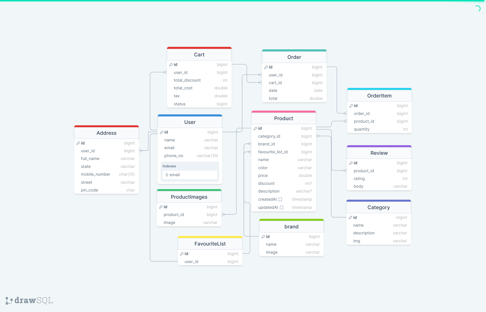

# 📝 eCommerce API

## 📄 Overview

An eCommerce API facilitates the development of an online store, allowing users to create, update, and retrieve product information, process orders, and manage customer data securely. It provides essential functionalities for building a complete eCommerce website and enables seamless integration with front-end applications.

## 📊 Database Schema

